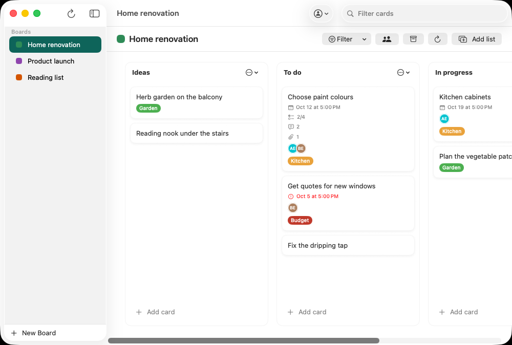
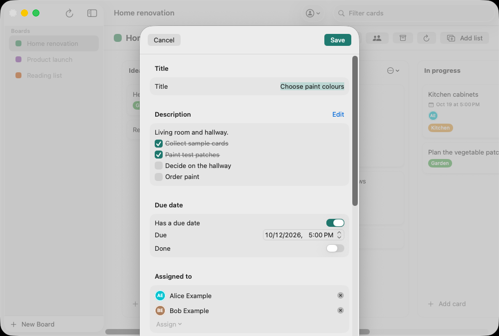
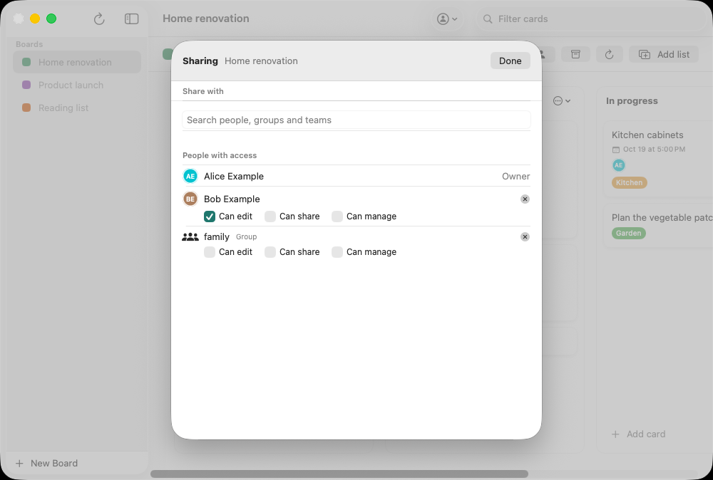

<p align="center"></p>

# Shuffleboard

**An unofficial native macOS client for [Nextcloud Deck](https://github.com/nextcloud/deck).** Shuffle the cards on your Deck boards from a fast, native Mac app.

> Shuffleboard is an independent project. It is not the official Nextcloud client and is not affiliated with or endorsed by Nextcloud GmbH. For official Nextcloud apps, see [nextcloud.com/install](https://nextcloud.com/install/).

## Install

With [Homebrew](https://brew.sh):

```bash
brew install --cask unicornops/tap/shuffleboard
```

Or download the DMG from the [latest release](https://github.com/unicornops/shuffleboard/releases/latest). Shuffleboard needs macOS 14 or later and is signed and notarized. From version 0.16.0 it keeps itself up to date (**Shuffleboard → Check for Updates…**); with Homebrew, earlier versions upgrade with `brew upgrade --cask shuffleboard`.

### Why "Shuffleboard"?

It's a board where you shuffle cards around, and shuffleboard is the game played on a ship's deck. The name nods to Deck without borrowing it: [Nextcloud's trademark guidelines](https://nextcloud.com/trademarks/) ask third-party clients not to use "Nextcloud" in their name, and we'd rather respect the project that makes this app possible. Until October 2026 this app was called "Nextcloud Deck for macOS", which used Nextcloud's trademark in a way it shouldn't have.

### Upgrading from "Nextcloud Deck for macOS"

Shuffleboard has a new app identity (bundle ID `ie.unicornops.shuffleboard`), so macOS treats it as a new app:

1. In the old app, choose **Sign Out** from the account menu. This revokes its app password on your server (in versions that support it). Otherwise, remove the old device under **Nextcloud → Settings → Security**.
2. Delete the old `NextcloudDeck.app`.
3. Open Shuffleboard and sign in once.

Your boards live on your Nextcloud server, so nothing is lost. The old app's Keychain entry can be removed in Keychain Access (search for `nextclouddeck`).

## Screenshots

<picture>
  <source media="(prefers-color-scheme: dark)" srcset="docs/screenshots/board-dark.png">
  
</picture>

<picture>
  <source media="(prefers-color-scheme: dark)" srcset="docs/screenshots/card-dark.png">
  
</picture>

<picture>
  <source media="(prefers-color-scheme: dark)" srcset="docs/screenshots/sharing-dark.png">
  
</picture>

The screenshots are taken by the end-to-end UI tests from demo data (see [End-to-end tests](#end-to-end-tests)).

## Features

- **Sign in** with your Nextcloud server URL: the app opens your browser to sign in (including two-factor authentication) using [Nextcloud Login Flow v2](https://docs.nextcloud.com/server/latest/developer_manual/client_apis/LoginFlow/index.html), receives an app password and stores it securely in the system Keychain. Signing out revokes the app password.
- **Multiple accounts:** sign in to more than one account, on one server or several, with **Add Account…** in the account menu, and switch between them there. Each account's app password is kept in the Keychain; signing out of one revokes only its app password and switches to the next.
- **Boards** listed in the sidebar; switch between them to focus on one board at a time. Rename a board or change its color with **Edit Board…** in its context menu, or the pencil next to its title.
- **Kanban board view**: stacks as columns, cards in each column. Create lists (stacks) and cards, open cards to edit title and description. Rename a list by double-clicking its title, or with **Rename list** in its menu.
- **Automatic updates** with [Sparkle](https://sparkle-project.org): Shuffleboard checks for new releases and installs them, or use **Shuffleboard → Check for Updates…**. Every update is verified against the app's EdDSA public key.
- Built with **SwiftUI** and follows current macOS design (toolbars, sidebar, materials).

## Requirements

- macOS 14.0+
- Xcode 15+ (to build)
- A Nextcloud server with the [Deck](https://apps.nextcloud.com/apps/deck) app installed.

## Developer tooling

The project uses several tools to enforce code quality. Every pull request runs `swiftformat --lint` and `swiftlint lint --strict` (any warning fails), using the versions pinned in `.github/workflows/pr-validation.yml` (SwiftFormat 0.63.1, SwiftLint 0.65.1). Install them all with Homebrew:

```bash
brew install pre-commit swiftformat swiftlint pmd
pre-commit install && pre-commit install --hook-type commit-msg
```

| Tool | Purpose | Config |
|------|---------|--------|
| [SwiftFormat](https://github.com/nicklockwood/SwiftFormat) | Code formatting | `.swiftformat` |
| [SwiftLint](https://github.com/realm/SwiftLint) | Style & lint rules | `.swiftlint.yml` |
| [PMD](https://pmd.github.io) | Static analysis + copy-paste detection | `pmd-ruleset.xml` |
| [pre-commit](https://pre-commit.com) | Runs all checks before each commit | `.pre-commit-config.yaml` |

### PMD

PMD runs two checks on every commit and on every pull request:

- **Static analysis** (`pmd check`) — all four built-in Swift rules:
  - `ProhibitedInterfaceBuilder` — flags accidental `@IBOutlet`/`@IBAction` usage in this pure-SwiftUI app.
  - `UnavailableFunction` — ensures `@available(*, unavailable)` stubs call `fatalError()`.
  - `ForceCast` — prohibits `as!` which can crash at runtime.
  - `ForceTry` — prohibits `try!` which suppresses structured error handling.
- **Copy-paste detection** (`pmd cpd`) — finds duplicated blocks of 50+ tokens across all Swift source files.

To suppress a specific PMD violation in source (use sparingly, with a reason):

```swift
let value = foo as! Bar // NOPMD - safe: type is guaranteed by the API contract
```

Run PMD locally at any time:

```bash
# Static analysis
pmd check --rulesets pmd-ruleset.xml --dir Shuffleboard --format text

# Copy-paste detection
pmd cpd --minimum-tokens 105 --dir Shuffleboard --language swift --format text
```

## Build and run

1. Open `Shuffleboard.xcodeproj` in Xcode.
2. Select the **Shuffleboard** scheme and a Mac destination.
3. Press **Run** (⌘R).

Or from the terminal:

```bash
xcodebuild -scheme Shuffleboard -configuration Debug -destination 'platform=macOS' build
open ~/Library/Developer/Xcode/DerivedData/Shuffleboard-*/Build/Products/Debug/Shuffleboard.app
```

### Running tests

Unit tests live in `ShuffleboardTests/` and run inside the app. Press **⌘U** in Xcode, or:

```bash
xcodebuild test -scheme Shuffleboard -destination 'platform=macOS' CODE_SIGN_IDENTITY=- CODE_SIGN_STYLE=Manual DEVELOPMENT_TEAM=
```

They never touch the real Keychain or a real server: `AppState` takes an in-memory `CredentialStore` and a `URLSession` that talks to `StubURLProtocol`. They run on every pull request.

### End-to-end tests

The end-to-end tests run the app against a real Nextcloud server with the Deck app, so they catch the server behaving differently from what the unit tests assume. There are two kinds:

- **API tests** (`ShuffleboardTests/Server*`): every Deck endpoint the app uses through `DeckAPI`, and `AppState`'s sign-in, multiple accounts, card moves and sign-out. One test signs in with Login Flow v2 for real, approving it on the server's own login and grant pages.
- **UI tests** (`ShuffleboardUITests`, scheme `ShuffleboardUITests`): the app driven through its windows. They create lists and cards, drag a card to another list, edit a card, comment, share a board, switch accounts and sign out. Each test checks the result on the server, not just on screen.

The scripts in `scripts/e2e/` start a throwaway server without Docker. Nextcloud runs on PHP's built-in server behind [Caddy](https://caddyserver.com), which serves it at `https://localhost:8443` with its own local CA, and uses SQLite. Everything lives in `build/e2e`. You need PHP 8.3 or 8.4 and Caddy (`brew install php@8.4 caddy`).

```bash
scripts/e2e/start-server.sh   # Nextcloud (NEXTCLOUD_VERSION=latest, 35 or 35.0.1) with the newest Deck for it (or DECK_VERSION=1.19.0)
scripts/e2e/trust-ca.sh       # trust the server's local CA (asks for your password)
scripts/e2e/seed.sh           # demo boards, users alice and bob, the group "family"
scripts/e2e/test.sh api       # or: test.sh ui, test.sh screenshots
scripts/e2e/stop-server.sh
```

When you're done, remove the CA again in Keychain Access ("Caddy Local Authority" in the System keychain) and delete `build/e2e`. Without a server, the end-to-end tests skip themselves, so the normal test run above doesn't need one.

To sign in, the UI tests pass app passwords to the app in its launch environment. Only Debug builds read them (`UITestLaunch`) and keep them in memory, so UI tests never read or write the Keychain. Release builds always use the Keychain and the browser sign-in.

The **End-to-end tests** workflow runs on every pull request against the newest Nextcloud that Deck supports. Every day it also runs against every Nextcloud major that still gets releases, each with its newest Deck, and opens an issue if a run fails. Failed runs upload `nextcloud.log` and the test results. Run it by hand (Actions → End-to-end tests → Run workflow) to pick versions, or tick **screenshots** to retake the README screenshots from the demo data in light and dark mode. That run opens a pull request with the new screenshots in `docs/screenshots/`.

### Building a signed DMG for distribution

From the repo root:

1. **Generate the app icon** (requires [librsvg](https://wiki.gnome.org/Projects/LibRsvg) for SVG→PNG, or place a 1024×1024 `icon_1024.png` in `Shuffleboard/Assets.xcassets/AppIcon.appiconset/`):

   ```bash
   ./generate-appicon.sh
   ```

2. **Build Release** (sign with your Developer ID before creating the DMG if you want a signed app):

   ```bash
   xcodebuild -project Shuffleboard.xcodeproj -scheme Shuffleboard -configuration Release -derivedDataPath build/DerivedData build
   ```

3. **Create the DMG**:

   ```bash
   APP_PATH=$(find build/DerivedData/Build/Products -name "Shuffleboard.app" -type d | head -n 1)
   ./create-dmg.sh "$APP_PATH" Shuffleboard-1.0.0.dmg "Shuffleboard 1.0.0"
   ```

The icon source is `icon_source.svg`; edit it and re-run `./generate-appicon.sh` to refresh the app icon.

## Releases

Releases are made by [release-please](https://github.com/googleapis/release-please). Merging its release pull request tags the version and creates a GitHub **pre-release**. The **Release Please** workflow then builds the app (signed and notarized), creates a DMG and a ZIP, and attaches them, with the Sparkle `appcast.xml` and `checksums.txt`.

A pre-release reaches nobody automatically. Installed copies check `releases/latest/download/appcast.xml`, and the Homebrew tap follows the latest release; GitHub never counts a pre-release as the latest. To ship one:

1. Download the DMG from the pre-release and test it.
2. Run the **Promote Release** workflow (Actions → Promote Release → Run workflow) with its tag, e.g. `v1.2.3`. It checks that the build attached everything and that the version is newer than the current release, then makes it the full, latest release.
3. Installed copies are offered the update on their next check. The Homebrew tap updates on its next daily run; run **Update Shuffleboard** in [unicornops/homebrew-tap](https://github.com/unicornops/homebrew-tap) to update it straight away.

A pre-release that fails testing stays a pre-release. Fix the problem, and the next release pull request builds a new pre-release.

- **Icon**: The workflow runs `./generate-appicon.sh` (using `librsvg` on the runner) so the built app and DMG use the icon from `icon_source.svg`.
- **Signing and notarization**: The workflow signs and notarizes the app by default. Configure these repository secrets for the release job to succeed: `APPLE_CERTIFICATE_BASE64`, `APPLE_CERTIFICATE_PASSWORD`, `APPLE_TEAM_ID`, `APPLE_DEVELOPER_ID`, `APPLE_APP_PASSWORD`. Notarization requests are retried, so one dropped request to Apple doesn't fail the release.
- **Updates**: the workflow signs the ZIP with the Sparkle EdDSA private key (repository secret `SPARKLE_ED_PRIVATE_KEY`, passed to Sparkle's `sign_update` on stdin) and attaches `appcast.xml` to the release. Installed copies check `releases/latest/download/appcast.xml` (`SUFeedURL` in `Shuffleboard/Info.plist`, next to the public key `SUPublicEDKey`). Losing the private key means existing installs can't be updated automatically, so keep a copy in a secret store.
- **Rebuilds and dry runs**: run the **Release Please** workflow by hand with a `tag_name` to rebuild that release's assets, or with `dry_run` checked to build, sign and notarize the selected branch without uploading anything.

## API

The app uses only the documented [Nextcloud Deck REST API](https://deck.readthedocs.io/en/latest/API/): v1.0 for boards, lists, cards and labels, and v1.1 for attachments (Deck 1.3 or later):

- `GET /boards` – list boards
- `GET /boards/{id}/stacks` – list stacks (columns) with cards
- Create/update/delete for boards, stacks, and cards
- `PUT /boards/{id}/stacks/{id}/cards/{id}/reorder` – move a card within or between lists
- `/boards/{id}/stacks/{id}/cards/{id}/attachments[/{type}/{id}]` (v1.1) – list, download, upload and delete attachments

Authentication uses Basic auth with the app password obtained through Login Flow v2 (`POST /index.php/login/v2`, then polling). Sign-out revokes it with `DELETE /ocs/v2.php/core/apppassword`.

## Project structure

- **Shuffleboard/** – main app target
  - **Models/** – `Board`, `Stack`, `Card`, `DeckLabel` (Deck API types)
  - **Services/** – `DeckAPI`, `NextcloudAuth`, `KeychainStorage`
  - **Views/** – Login, board list, board detail (columns + cards), card sheet, new stack sheet
  - **Helpers/** – `Color+Hex` for label/board colors
- **ShuffleboardTests/** – unit tests, plus end-to-end API tests (`Server*`) that need a test server
- **ShuffleboardUITests/** – UI tests against a test server
- **scripts/e2e/** – start, seed and stop the end-to-end test server, and run the tests

## License

Shuffleboard is free software, licensed under the [GNU General Public License v3.0](LICENSE). You may use, study, share and modify it; if you distribute it or a modified version, you must do so under the same licence and make the source code available.

Nextcloud is a trademark of Nextcloud GmbH. Shuffleboard is an independent, unofficial client for the Deck app and is not affiliated with or endorsed by Nextcloud.
